<h1 align="center">基于SpringBoot的企业级OA管理系统【带论文】</h1>

- <b>完整代码获取地址：从戎源码网 ([https://armycodes.com/](https://armycodes.com/))</b>
- <b>技术探讨、资料分享，请加QQ群：692619798</b>
- <b>作者微信：19941326836  QQ：952045282</b>
- <b>承接计算机毕业设计、Java毕业设计、Python毕业设计、深度学习、机器学习</b>
- <b>选题+开题报告+任务书+程序定制+安装调试+论文+答辩ppt 一条龙服务</b>
- <b>所有选题地址 ([https://github.com/Descartes007/allProject](https://github.com/Descartes007/allProject)) </b>

## 一、项目介绍

本项目是基于SpringBoot的企业级OA管理系统，面向后台管理员与普通用户两类角色。主要功能模块与各角色职责如下：
### 管理员（后台管理）
- 基本操作：登录、登出、修改密码、管理个人信息
- 用户管理：用户列表分页、查看详情、新增/修改/删除用户、重置密码、管理用户权限/角色信息
- 字典管理：维护字典项（部门、岗位、性别、公告类型、审批状态等），为前端返回友好显示值
- 工作审批：查看/筛选审批记录、审批/驳回流程、查看历史记录
- 通知公告：发布公告、编辑公告、删除公告、查看公告详情
- 日程/日志管理：增删改查日程与日志
- 公共资源：文件附件上传管理、富文本内容管理
### 普通用户（前端）
- 基本操作：注册、登录、修改密码、查看/编辑个人信息
- 工作审批：提交审批申请、查看审批状态与结果
- 个人便签：增删改查个人便签
- 通知公告：查看公告列表与详情
- 日程/日志：管理个人日程与日志
- 文件上传：上传附件（如审批附件、富文本图片等）

## 二、项目技术

- 编程语言：Java（后端
- 项目架构：B/S 架构

## 三、运行环境

- JDK版本：1.8及以上都可以
- 操作系统：Windows7/10、MacOS
- 开发工具：IDEA、Ecplise、MyEclipse都可以

## 四、数据库配置文件

- npm版本：6.14.13及以上都可以
- Redis版本：3.2.100及以上都可以
- 文件名：application.yml和application-dev.yml
- 编码类型：utf8

## 论文截图

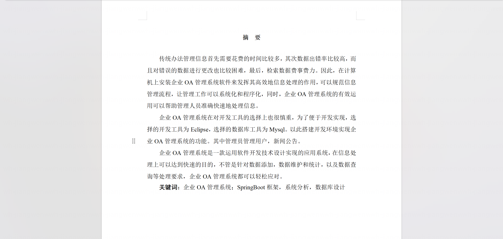

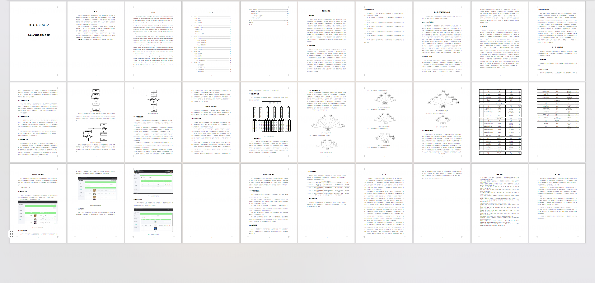

## 系统截图

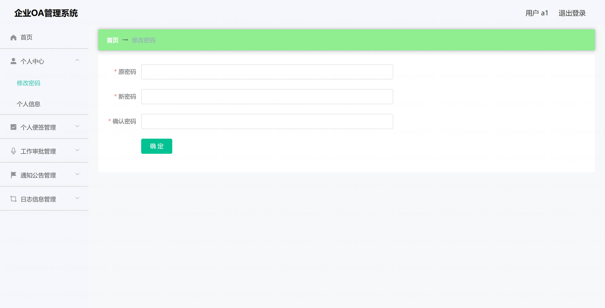

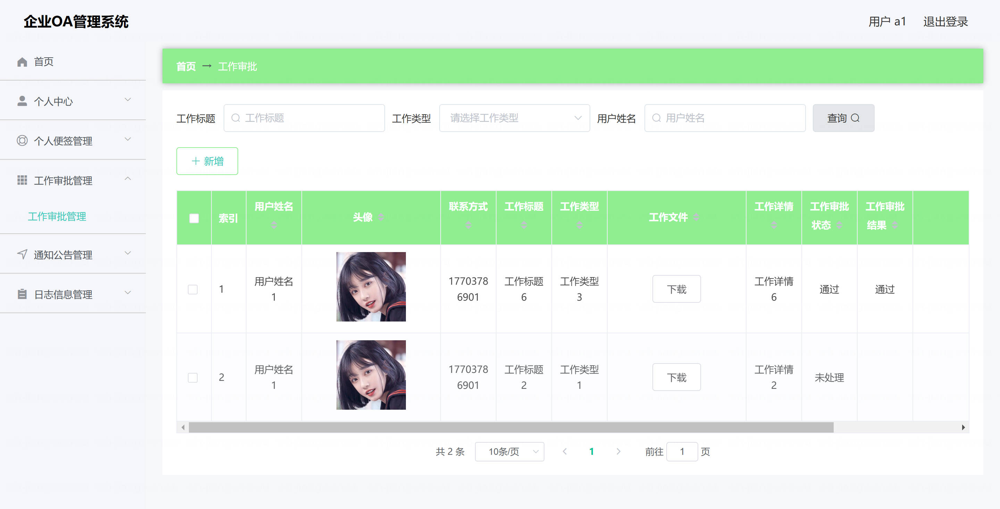

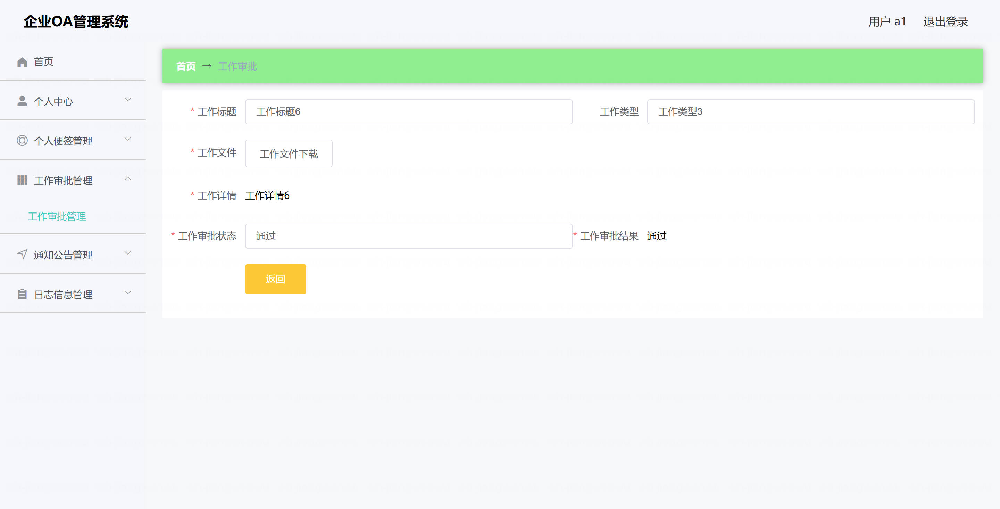

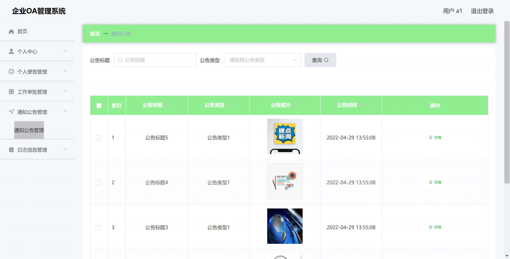

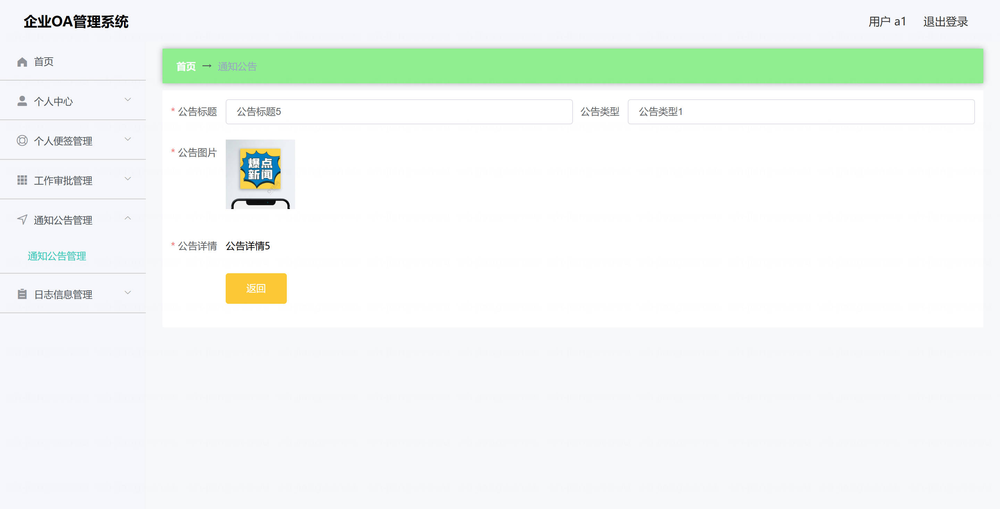

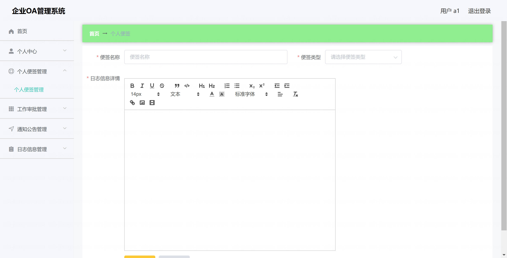

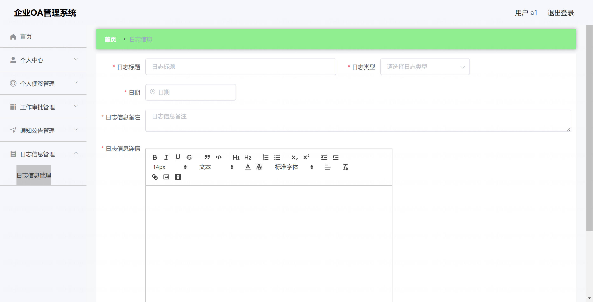

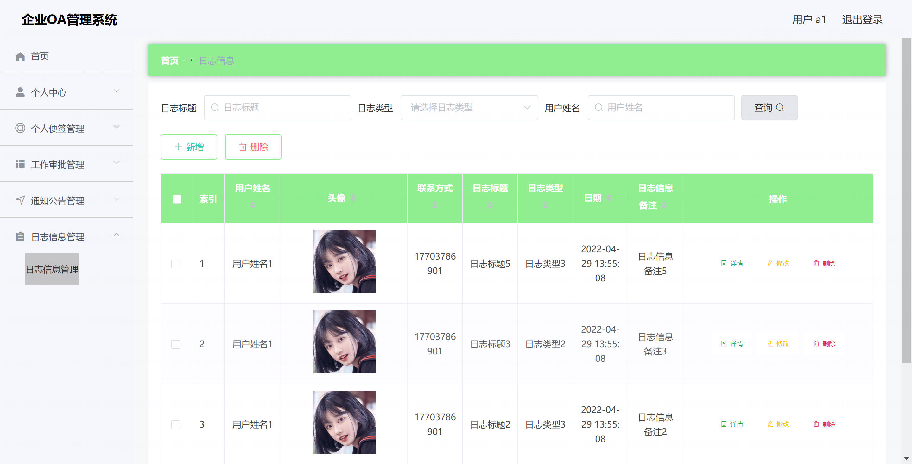

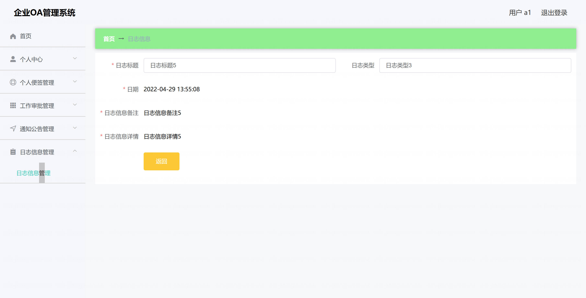

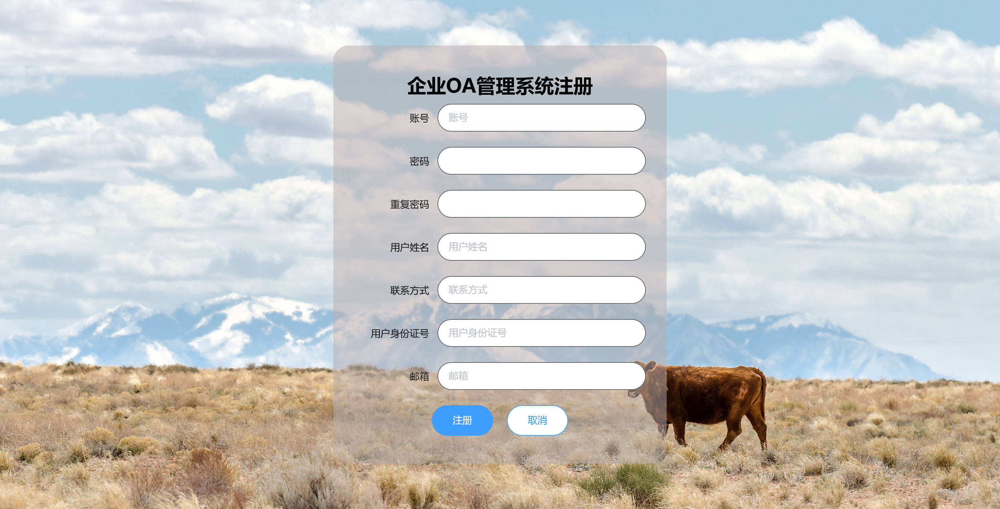
